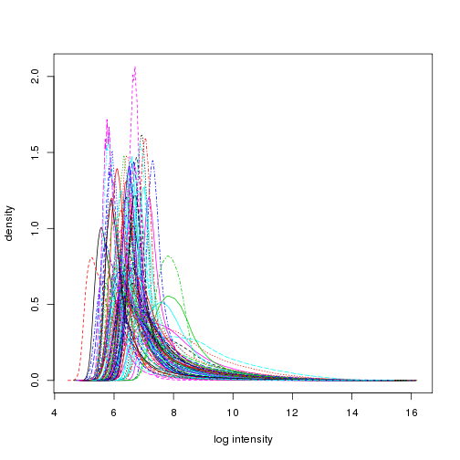
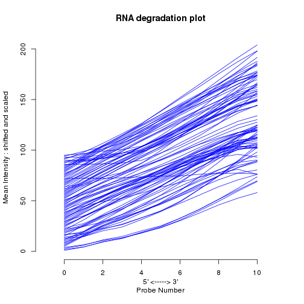
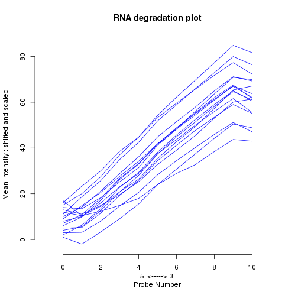
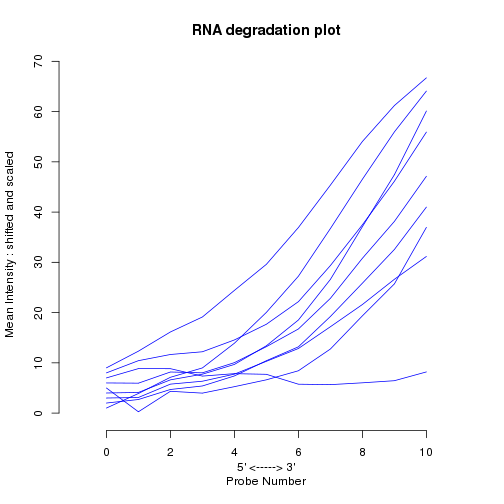
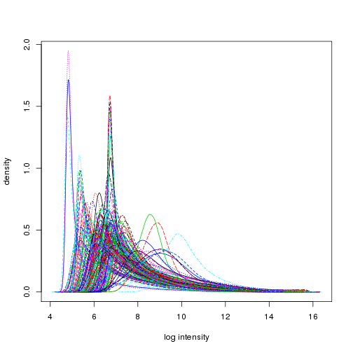
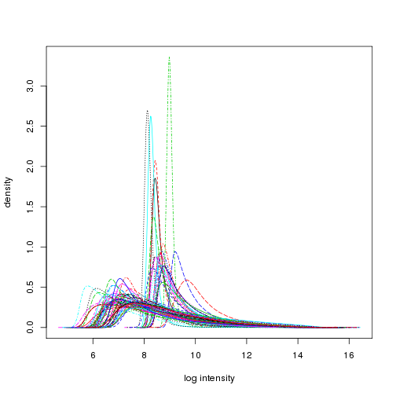
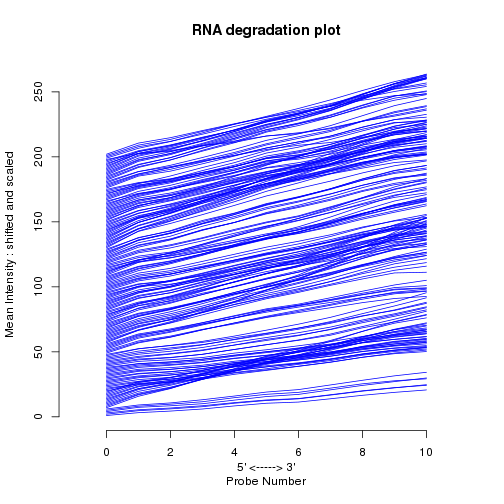
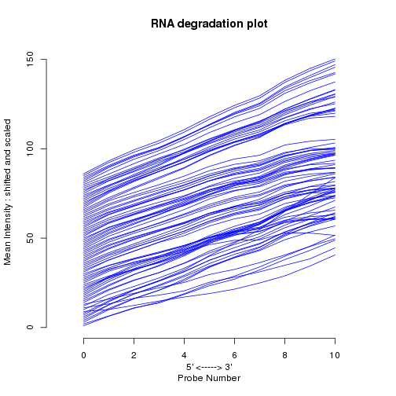

Quality Control Report
========================================================
```

```


This file contains the quality control information on the chips we used and choose not to use. 

We were able to find limited amounts of human cell type specific data but they were shown to be of very poor quality. The sources and GEO IDs of these datasets can be found from [this](Data/humanCellTypeDesign.tsv) file


Human data was found on 3 chips `platforms r`. Below, the percentages of MM>PM signals on each chip group can be found

```r
lapply(affies,function(x){
    mean(mm(x)>pm(x))
})
```

```
## Loading required package: AnnotationDbi
## 
## 
## 
## Attaching package: 'u133x3pcdf'
## 
## The following object(s) are masked from 'package:hgu133plus2cdf':
## 
##     i2xy, xy2i
## 
## 
## 
## Attaching package: 'hgu133acdf'
## 
## The following object(s) are masked from 'package:u133x3pcdf':
## 
##     i2xy, xy2i
## 
## The following object(s) are masked from 'package:hgu133plus2cdf':
## 
##     i2xy, xy2i
```

```
## $`Affymetrix U133 Plus 2.0`
## [1] 0.3319178
## 
## $`Affymetrix U133_X3P`
## [1] 0.3612196
## 
## $`Affymetrix U133A`
## [1] 0.4254485
```

A quite messy plots of density distributions. The densities themselves are also messy.

```r
ground = lapply(affies,hist)
```

   

And RNA degredation plots

```r
ground = lapply(affies, function(x){
    deg = AffyRNAdeg(x)
    print(mean(deg$slope))
    plotAffyRNAdeg(deg)
})
```

```
## [1] 8.691982
```

 

```
## [1] 6.182243
```

 

```
## [1] 3.976004
```

 


Lets proceed to our lovely mouse data, that has two platforms


```r
lapply(affies,function(x){
    mean(mm(x)>pm(x))
})
```

```
## 
## 
## Attaching package: 'mouse4302cdf'
## 
## The following object(s) are masked from 'package:hgu133acdf':
## 
##     i2xy, xy2i
## 
## The following object(s) are masked from 'package:u133x3pcdf':
## 
##     i2xy, xy2i
## 
## The following object(s) are masked from 'package:hgu133plus2cdf':
## 
##     i2xy, xy2i
## 
## 
## 
## Attaching package: 'moe430acdf'
## 
## The following object(s) are masked from 'package:mouse4302cdf':
## 
##     i2xy, xy2i
## 
## The following object(s) are masked from 'package:hgu133acdf':
## 
##     i2xy, xy2i
## 
## The following object(s) are masked from 'package:u133x3pcdf':
## 
##     i2xy, xy2i
## 
## The following object(s) are masked from 'package:hgu133plus2cdf':
## 
##     i2xy, xy2i
```

```
## $`Affymetrix 430 2.0`
## [1] 0.2769139
## 
## $`Affymetrix MOE430A`
## [1] 0.2916909
```

```r
ground = lapply(affies,hist)
```

  

```r
ground = lapply(affies, function(x){
    deg = AffyRNAdeg(x)
    print(mean(deg$slope))
    plotAffyRNAdeg(deg)
})
```

```
## [1] 5.437618
```

 

```
## [1] 4.84261
```

 

