pH correlation report
========================================================


This file includes an analysis of correlations of gene expression in brain to pH in different regions of the brain


Loading of the data and preallocation in a probe-based manner


Gettind the correlations and average expressions


Looking at the correlations of upper and lower %99 interval

```r
print('higher')
```

```
## [1] "higher"
```

```r
quant = quantile(abs(corrs),0.99)
keep = apply(abs(corrs),1,function(x){any(x>quant)})
# breaks = quantile(corrs[keep,],c(seq(0,1,0.1)))
p=heatmap.2(corrs[keep,], trace = "none",#breaks = breaks,
            col = heatPaletteWideWhite,
            cexCol=1,dendrogram = 'column', key = T, symbreaks = T
            )
```

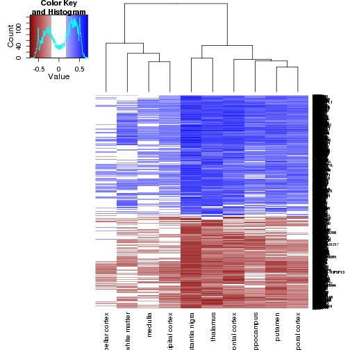 

```r
heatmap.2(medianExp[keep,][rev(p$rowInd),p$colInd], trace = "none",# breaks = breaks,
            col = heatPalette,  Rowv=F,Colv=F,
            cexCol=1,dendrogram = 'none', key = T, symbreaks = F
            )
```

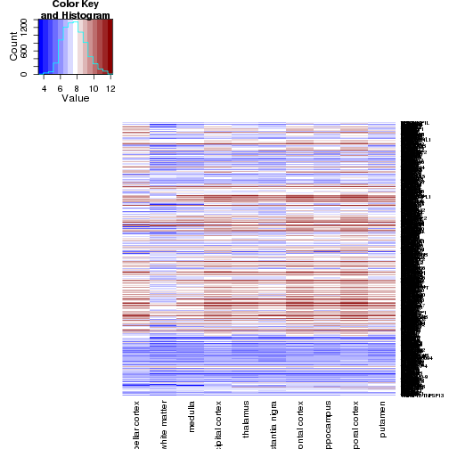 

```r
quant = quantile(abs(corrs),0.01)
keep = apply(abs(corrs),1,function(x){any(x<quant)})
print('lower')
```

```
## [1] "lower"
```

```r
p=heatmap.2(corrs[keep,], trace = "none",#breaks = seq(-1,1,0.01),
            col = heatPaletteWideWhite,
            cexCol=1,dendrogram = 'column',symbreaks=T)
```

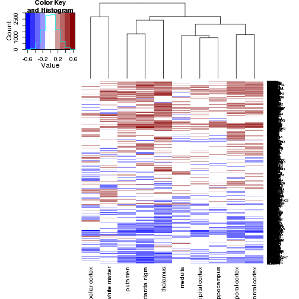 

```r
heatmap.2(medianExp[keep,][rev(p$rowInd),p$colInd], trace = "none",# breaks = breaks,
            col = heatPalette,  Rowv=F,Colv=F,
            cexCol=1,dendrogram = 'none', key = T, symbreaks = F
            )
```

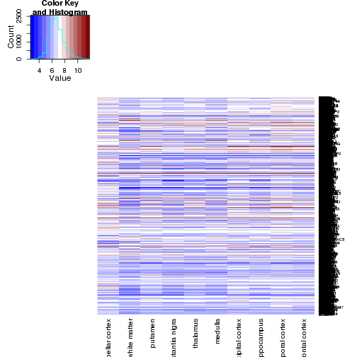 


enrichment analysis for lilah's  genes in the upper quantile


```r
quant = quantile(abs(corrs),0.95)
keep = apply(abs(corrs),1,function(x){any(x>quant)})
x=c(sum(genes_GSE538 %in% rownames(corrs[keep,])), 
    sum(genes_GSE12649 %in% rownames(corrs[keep,])))
print('matched genes')
```

```
## [1] "matched genes"
```

```r
sum(genes_GSE538 %in% rownames(corrs[keep,]))
```

```
## [1] 37
```

```r
print('extreme genes')
```

```
## [1] "extreme genes"
```

```r
sum(rownames(corrs) %in% genes_GSE538)
```

```
## [1] 67
```

```r
print('total genes')
```

```
## [1] "total genes"
```

```r
nrow(corrs)
```

```
## [1] 10883
```

```r
dhyper(sum(genes_GSE538 %in% rownames(corrs[keep,])),
       sum(rownames(corrs) %in% genes_GSE538),
       nrow(corrs) - sum(rownames(corrs) %in% genes_GSE538),
       sum(keep))
```

```
## [1] 6.207607e-07
```

```r
print('matched genes')
```

```
## [1] "matched genes"
```

```r
sum(genes_GSE12649 %in% rownames(corrs[keep,]))
```

```
## [1] 27
```

```r
print('extreme genes')
```

```
## [1] "extreme genes"
```

```r
sum(rownames(corrs) %in% genes_GSE12649)
```

```
## [1] 54
```

```r
print('total genes')
```

```
## [1] "total genes"
```

```r
nrow(corrs)
```

```
## [1] 10883
```

```r
dhyper(sum(genes_GSE12649 %in% rownames(corrs[keep,])),
       sum(rownames(corrs) %in% genes_GSE12649),
       nrow(corrs) - sum(rownames(corrs) %in% genes_GSE12649),
       sum(keep))
```

```
## [1] 0.0001623735
```

Heatmaps of extreme genes

```r
p=heatmap.2(corrs[rownames(corrs) %in% genes_GSE538,] , trace = "none",
          col = heatPaletteWideWhite, cexCol=1,dendrogram = 'column')
```

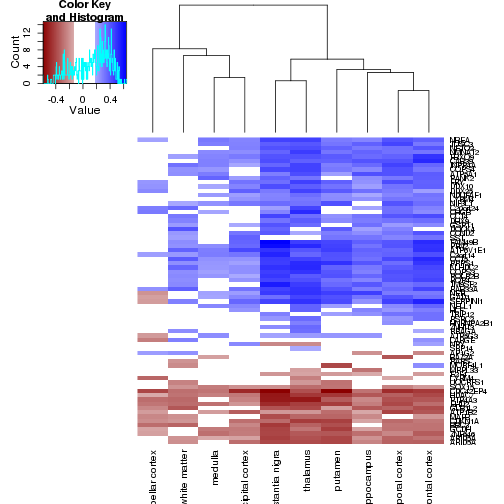 

```r
heatmap.2(medianExp[rownames(medianExp) %in% genes_GSE538,][rev(p$rowInd),p$colInd],
          trace = "none",# breaks = breaks,
            col = heatPalette,  Rowv=F,Colv=F,
            cexCol=1,dendrogram = 'none', key = T, symbreaks = F
            )
```

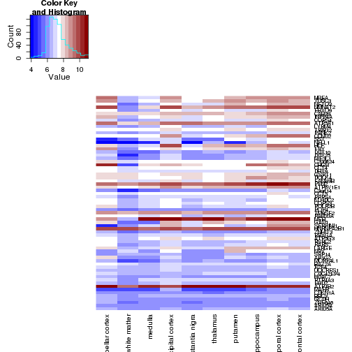 

```r
p=heatmap.2(corrs[rownames(corrs) %in% genes_GSE12649,] , trace = "none",
          col = heatPaletteWideWhite, cexCol=1,dendrogram = 'column')
```

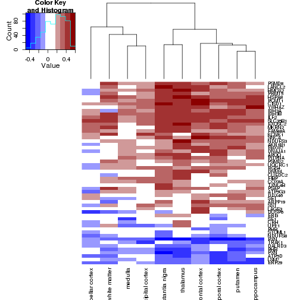 

```r
heatmap.2(medianExp[rownames(medianExp) %in% genes_GSE12649,][rev(p$rowInd),p$colInd],
          trace = "none",# breaks = breaks,
            col = heatPalette,  Rowv=F,Colv=F,
            cexCol=1,dendrogram = 'none', key = T, symbreaks = F
            )
```

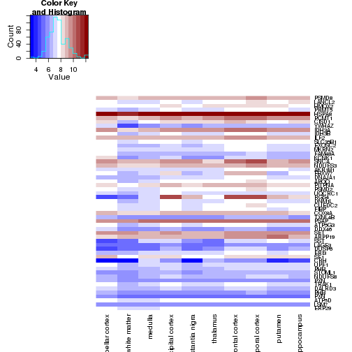 


pH correlations of all genes accross regions

```r
frame = melt(abs(corrs))
frame$Var2 = factor (frame$Var2,levels = names(sort(apply(abs(corrs),2,mean),decreasing=T)))

lePlot = ggplot(frame,aes(x=Var2, y = value)) +
    geom_violin( color="#C4C4C4", fill="#C4C4C4") + 
    geom_boxplot(width=0.1,fill = 'lightblue') + 
    scale_y_continuous(name="Correlations to pH") +
    theme_bw() + 
    theme(axis.text.x  = element_text(size=20,angle=90),
          axis.title.y = element_text(vjust=0.5, size=25),
          axis.title.x = element_text(vjust=0.5, size=0) ,
          title = element_text(vjust=0.5, size=25),
          axis.text.y = element_text(size = 13))

(lePlot)
```

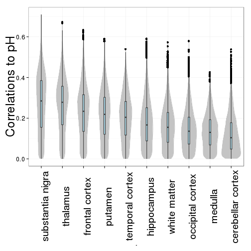 

expression accross all regions

```r
frame = melt(abs(medianExp))
frame$Var2 = factor (frame$Var2,levels = names(sort(apply(abs(corrs),2,mean),decreasing=T)))

lePlot = ggplot(frame,aes(x=Var2, y = value)) +
    geom_violin( color="#C4C4C4", fill="#C4C4C4") + 
    geom_boxplot(width=0.1,fill = 'lightblue') + 
    scale_y_continuous(name="log2 expression") +
    theme_bw() + 
    theme(axis.text.x  = element_text(size=20,angle=90),
          axis.title.y = element_text(vjust=0.5, size=25),
          axis.title.x = element_text(vjust=0.5, size=0) ,
          title = element_text(vjust=0.5, size=25),
          axis.text.y = element_text(size = 13))

(lePlot)
```

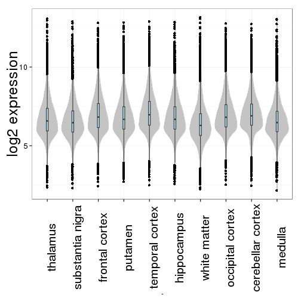 


pH correlations of top %99 quantile


```r
quant = quantile(abs(corrs),0.99)
keep = apply(abs(corrs),1,function(x){any(x>quant)})

frame = melt(abs(corrs[keep,]))
frame$Var2 = factor (frame$Var2,levels = names(sort(apply(abs(corrs[keep,]),2,mean),decreasing=T)))

lePlot = ggplot(frame,aes(x=Var2, y = value)) +
    geom_violin( color="#C4C4C4", fill="#C4C4C4") + 
    geom_boxplot(width=0.1,fill = 'lightblue') + 
    scale_y_continuous(name="Correlations to pH") +
    theme_bw() + 
    theme(axis.text.x  = element_text(size=20,angle=90),
          axis.title.y = element_text(vjust=0.5, size=25),
          axis.title.x = element_text(vjust=0.5, size=0) ,
          title = element_text(vjust=0.5, size=25),
          axis.text.y = element_text(size = 13))

(lePlot)
```

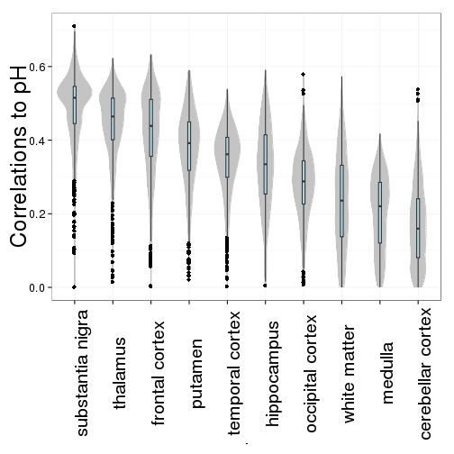 

expressions of top %99 quantile


```r
quant = quantile(abs(corrs),0.99)
keep = apply(abs(corrs),1,function(x){any(x>quant)})

frame = melt(abs(medianExp[keep,]))
frame$Var2 = factor (frame$Var2,levels = names(sort(apply(abs(corrs[keep,]),2,mean),decreasing=T)))

lePlot = ggplot(frame,aes(x=Var2, y = value)) +
    geom_violin( color="#C4C4C4", fill="#C4C4C4") + 
    geom_boxplot(width=0.1,fill = 'lightblue') + 
    scale_y_continuous(name="log2 expression") +
    theme_bw() + 
    theme(axis.text.x  = element_text(size=20,angle=90),
          axis.title.y = element_text(vjust=0.5, size=25),
          axis.title.x = element_text(vjust=0.5, size=0) ,
          title = element_text(vjust=0.5, size=25),
          axis.text.y = element_text(size = 13))

(lePlot)
```

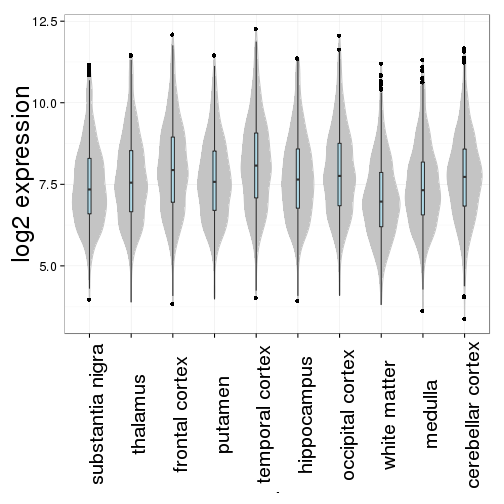 


Now to pH correlations of known marker genes. Temporarily I'm using the old genes because the new ones look weird now (just 3 genes for pyramidals... makes me sad)

```r
setwd(parent)
source('puristOut.R')
sourceGithub('OganM',toSource,homologene)
cortexGenes = puristOut("Data/BackupData/19 Jan Exp Backup/lilahSelect/Relax/Cortex_GabaDeep")

humanCortex = lapply(cortexGenes,mouse2human)

geneCors = vector(mode='list',length=len(humanCortex))
for (i in 1:len(humanCortex)){
    geneCors[[i]] =  corrs[rownames(corrs) %in% humanCortex[[i]]$humanGene,]
    heatmap.2( geneCors[[i]], trace = "none",
          col = heatPaletteWideWhite, cexCol=1,dendrogram = 'column',main =names(humanCortex[i]),symbreaks = T)

}
```

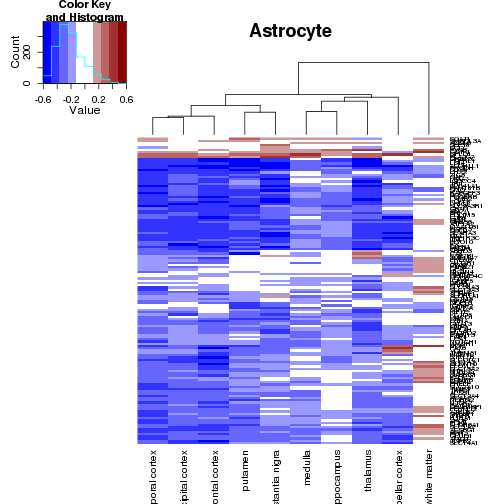 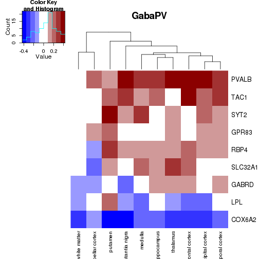 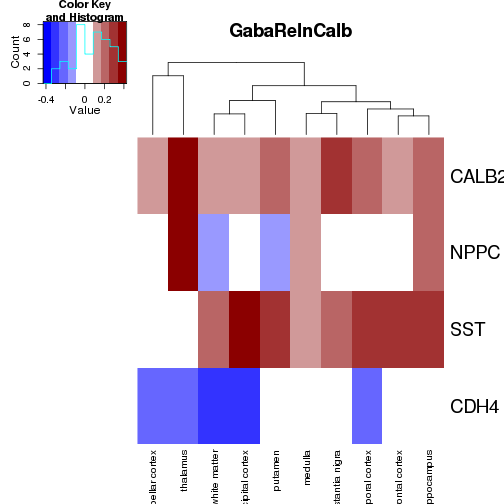 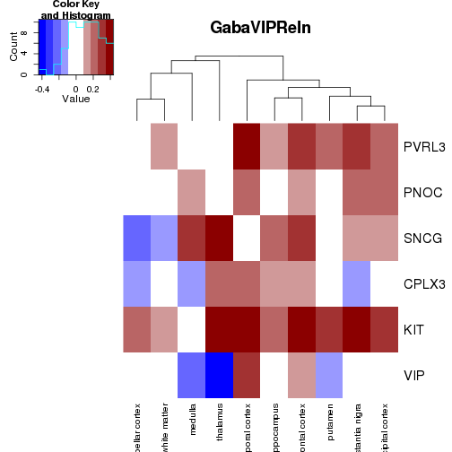 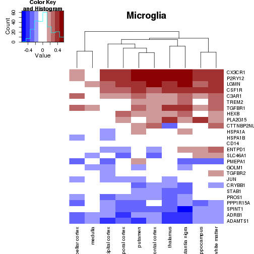 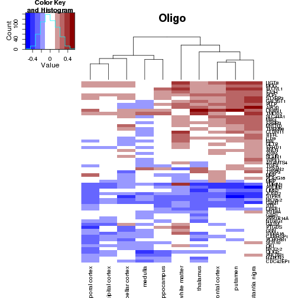 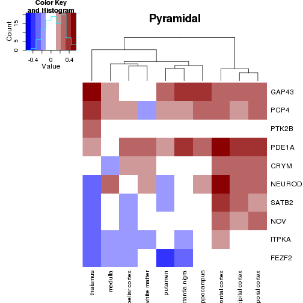 

Or look at their enrichment at the upper quantiles and see which ones are there

```r
setwd(parent)

quant = quantile(abs(corrs),0.99)
keep = apply(abs(corrs),1,function(x){any(x>quant)})

for (i in 1:len(humanCortex)){
    print(names(humanCortex[i]))
    x=sum(humanCortex[[i]]$humanGene %in% rownames(corrs[keep,]))
    print('how many are there?')
    print(sum(humanCortex[[i]]$humanGene %in% rownames(corrs[keep,])))
    print("is it enriched?")
    print(dhyper(sum(humanCortex[[i]]$humanGene %in% rownames(corrs[keep,])),
           sum(rownames(corrs) %in% humanCortex[[i]]$humanGene),
           nrow(corrs) - sum(rownames(corrs) %in% humanCortex[i]$humanGene),
           sum(keep)))
    }
```

```
## [1] "Astrocyte"
## [1] "how many are there?"
## [1] 15
## [1] "is it enriched?"
## [1] 0.03035343
## [1] "GabaPV"
## [1] "how many are there?"
## [1] 0
## [1] "is it enriched?"
## [1] 0.5040661
## [1] "GabaRelnCalb"
## [1] "how many are there?"
## [1] 0
## [1] "is it enriched?"
## [1] 0.7374637
## [1] "GabaVIPReln"
## [1] "how many are there?"
## [1] 0
## [1] "is it enriched?"
## [1] 0.6333298
## [1] "Microglia"
## [1] "how many are there?"
## [1] 3
## [1] "is it enriched?"
## [1] 0.1775322
## [1] "Oligo"
## [1] "how many are there?"
## [1] 2
## [1] "is it enriched?"
## [1] 0.1212013
## [1] "Pyramidal"
## [1] "how many are there?"
## [1] 1
## [1] "is it enriched?"
## [1] 0.3695985
```
chicken or egg...

PC1 correlation to pH in cortex

```r
setwd(parent)

regionExp = read.exp(grep('cerebellar cortex',regions,value=T))
names(regionExp)[4:len(regionExp)] = sub('_.*','',
                                             names(regionExp)[4:len(regionExp)])
relSoft = softFile[softFile$GSM %in% names(regionExp),]
for (i in 1:len(humanCortex)){
    relevant = regionExp[regionExp$Gene_Symbol %in% humanCortex[[i]]$humanGene,]
    list[relGene, relExpr] = sepExp(relevant)
    pca = prcomp(t(relExpr), scale = T)
    pca$rotation = pca$rotation * ((sum(pca$rotation[,1])<0)*(-2)+1)
    pca$x = t(as.matrix(t(scale(t(relExpr))))) %*% as.matrix(pca$rotation)
    frame = data.frame(PC1=pca$x[,1], pH = relSoft$pH)
    frame = frame[!frame$pH<5.5,]
    print(summary(lm(PC1 ~ pH, data = frame))$adj.r.squared)
    p=ggplot(frame, aes(y = PC1, x = pH))+geom_point()+  geom_smooth(method='lm') + ggtitle(names(humanCortex)[i])
    plot(p)
    }
```

```
## Error: could not find function "sepExp"
```


