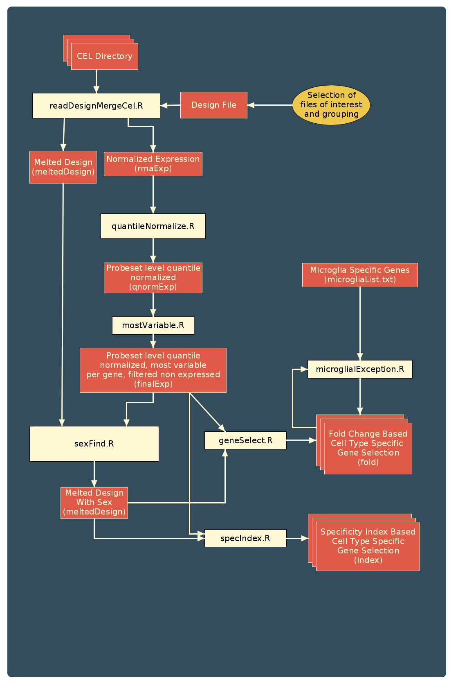
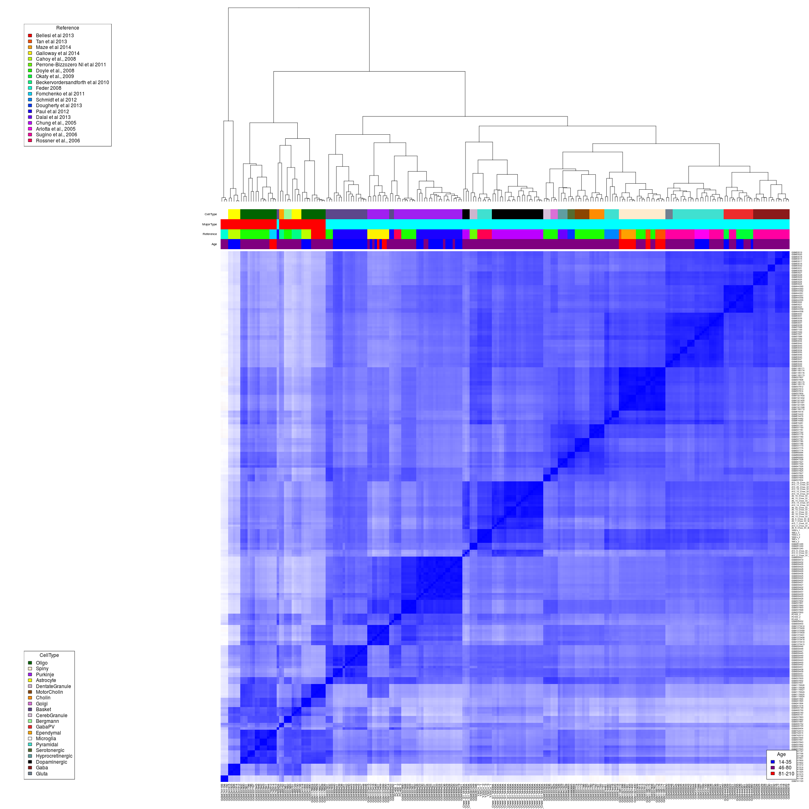

masterOfCellTypes
=================

**Disclaimer:** I haven't been updating this file for a while now. So everything is likely to be extremely out of date. This directory is currently being migrated to [here](https://github.com/oganm/brainCellTypeSpecificGenes) to improve organisation and prepare the code for publication. There won't be further updates here.

Use and modify run.R to do stuff. Variables in the first lines dictate what will it do. Most are self explanatory

Don't try running it with xls=TRUE and openoffice on.

Normalization
-----
**desFile:** Location of the original design file. Exact structure of the design file is mostly unimportant. Only rules are:
* First collumn must contain the names of CEL files separated by commas (you can change this by modifying the `celRegex` variable below)
* There must be a primary naming collumn specified at `namingCol` with NAs at rows that you do not want to take in
* What you wrote inside the `groupNames` must exist as collumns in the file
* It must have a "Platform" collumn that specifies the chip type that was used.
* It must be tab delimeted

**Note:** there is also an xls version of the design file in the directory. It is there to make editing easier and to be able to retain formulas if used to modify the fields. Export this as a tab delimeted file or directly use tab delimeted version. Just don't forget which one you just changes

**celRegex:** Regular expression that extracts the names of the cel files from the **FIRST** collumn of the design file. For a file that only has GSM files separated with commas `(GSM.*?(?=,|$))` should be enough. If you have other stuff to add just but an `|` after the last one continue writing

**celDir:** Location of the cel files. They are in the dropbox. Files from seperate platforms need to be at seperate folders named after the Platform field in the design file.

**outFolder:** Preferred location of the output for normalization

**namingCol:** Name of the naming collumn in the design file

**tinyChip:** Database file that needs to be used for the small chip

Cell type specific gene selection
---------

**geneOut:**  Name of the output folder for the selected genes

**geneOutIndex:** Name of the output folder for genes selected based on the specificity index as described [here](https://www.landesbioscience.com/journals/systemsbiomedicine/article/25630/) Takes way too much time though... I don't think I'll keep it in the constantly repeated part. Maybe to strengthen results later

**groupNames:** An array of strings that contain group names required for cel type specific gene selection

**regionNames:** Name of the collumns describind the region names. Or can be used for subgrouping for any reason.

**Note:** Right now even if you have many NA's in groupNames other that the `namingCol` they will still be normalized together with the rest of the samples included in the namingCol. A for loop that changes `namingCol`, `outFolder` and `geneOut` will help combat this if some groups are drastically exclusive.

About Files and Folders
========
Selected genes are stored in Data/Fold directory. Names of the folders always relate to the collumns of **Design.xls**, tdf. Their versions with a region name appended to the end uses that naming scheme only inside that region.
Currently the naming shcemes represent:

**CellType:** Includes mainstream cell type but does not include interneurons and stem cells.

**FullCellType:** Includes inter and stem cells as well

**GabaDeep** Same as **CellType** but has a deeper resolution of gabaergic neurons.

**ForContanim** is slightly more generalized (Gabaergics are merged,)

**Fold/Relax:** Folders in this directory include the genes selected for normal use. The first collumn is the gene name, the second is the fold change to the mean, the third is the silhouette coefficient when we use that gene to cluster. Includes both over and underexpressed stuff

**Fold/Marker:** Folders in this directory include the genes that are very stringently selected (10 fold difference to every other cell type) and used for estimation of contamination.

Scheme of the Pipeline
=====================
(Damn this is getting messy)

Latest clusters.

